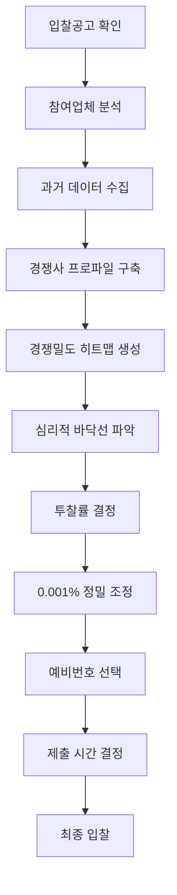

# 나라장터 복수예가입찰 완전분석 통합본

> 📅 최종 통합: 2024년
>
> 이 문서는 나라장터 복수예가입찰 시스템의 모든 분석 내용, Skills 설계, 데이터 구조, 실행 가이드를 하나로 통합한 최종본입니다.

---

## 📌 목차

1. [핵심 원리: 구조적 무작위성](#1-핵심-원리-구조적-무작위성)
2. [데이터 구조 및 전처리](#2-데이터-구조-및-전처리)
3. [분석 가능 영역과 불가능 영역](#3-분석-가능-영역과-불가능-영역)
4. [하한가 미달 데이터의 중요성](#4-하한가-미달-데이터의-중요성)
5. [AI 학습 데이터 보정 방법](#5-ai-학습-데이터-보정-방법)
6. [경쟁업체 행동 패턴 분석](#6-경쟁업체-행동-패턴-분석)
7. [전략적 실행 방법론](#7-전략적-실행-방법론)
8. [구현된 Skills 체계](#8-구현된-skills-체계)
9. [실무 적용 가이드](#9-실무-적용-가이드)

---

## 1. 핵심 원리: 구조적 무작위성

### 1.1 복수예가 시스템의 본질

나라장터 복수예가 방식은 본질적으로 **"수학적 확률이 아닌, 구조적으로 무작위성(Randomness)"** 위에 서 있기 때문에, 금액 중심의 데이터 분석만으로는 낙찰을 예측할 수 없습니다.

```
15개 예비가격 생성 (기초금액 ±2% 범위)
↓
4개 무작위 추첨
↓
평균 = 예정가격
↓
조합의 수: 15C4 = 1,365
↓
각 조합 확률: 1/1365 = 0.0732%
```

### 1.2 예측 불가능성의 수학적 증명

- **예정가격 자체를 예측할 수 없다**: 1365가지 경우의 수 중 하나가 완전 무작위로 선택
- **낙찰하한가도 예정가격이 결정되기 전까지는 불명확**: 하한율은 고정이지만, 예정가격이 달라지면 하한가도 변동
- **결론**: 가격 중심의 수학적 분석은 본질적으로 예측 확률이 1/1365 이하

> **핵심 메시지**: "금액 분석은 '운의 영역'이고, 이 구조 안에서 분석을 시도할수록 오히려 계산오차가 증가합니다."

---

## 2. 데이터 구조 및 전처리

### 2.1 실제 데이터 구조 (영구 기록)

#### 필수 17개 컬럼 구조

| 컬럼번호 | 컬럼명 | 설명 | 예시값 |
|---------|--------|------|--------|
| 1 | 순위 | 입찰순위 | 1, 2, 3... |
| 2 | 사업자등록번호 | 업체 식별자 | 123-45-67890 |
| 3 | 업체명 | 참여업체명 | (주)한국건설 |
| 4 | 대표자 | 대표자명 | 홍길동 |
| 5 | 투찰일시 | 입찰제출시간 | 2024/08/14 14:30:00 |
| 6 | 투찰금액(원) | 실제 투찰금액 | 72,276,220 |
| 7 | 예가대비투찰률(%) | 예정가격 대비 비율 | 88.000 |
| 8 | 투찰률(%) | 기초금액 대비 비율 | 87.745 |
| 9 | 추첨번호 | 선택한 복수예가번호 | 3,6,10,15 |
| 10 | 투찰여부 | 참여상태 | 참여 |
| 11 | 미달사유 | 실격사유 | 낙찰하한미달 |
| 12 | 제한사항 | 참가자격 | 해당없음 |
| 13 | 비고 | 추가정보 | - |
| 14 | 예정가격 | 계산된 예정가격 | 82,097,523 |
| 15 | 낙찰하한가(원) | 최저낙찰가능금액 | 72,276,574 |
| 16 | 기초금액(원) | 발주처 산정 기준가 | 82,349,456 |
| 17 | 낙찰하한가차이(원) | 하한가와의 차이 | -354 |

#### 발주처별 낙찰하한율 매핑

| 발주처 | 낙찰하한율 | 샘플 파일 | 특징 |
|--------|-----------|-----------|------|
| 조달청/경상남도 | 80.495% | 20230905571-00 | 가장 낮은 하한율 |
| 국가유산진흥원 | 86.745% | 20230920668-00 | 중간 하한율 |
| 한국문화재재단 | 87.745% | 20240319067-00 | 표준 하한율 |
| 문화재청 | 88.000% | 20240319050-00 | 높은 하한율 |

### 2.2 데이터 전처리 핵심 규칙

```python
def preprocess_bidding_data(raw_data):
    """
    나라장터 입찰 데이터 전처리
    """
    # 1. 입찰 건 필터링
    valid_data = filter_valid_bids(raw_data)
    # - 공고번호 쌍 체크 (예: 20230920668-00)
    # - 참여업체 5개 이상
    # - 문화재연구원 포함 여부

    # 2. 업체명 정규화
    normalized = normalize_company_names(valid_data)
    # - (재), (재단), 재단법인 제거
    # - 문화재연구원 통일

    # 3. 사정률 필터링
    filtered = filter_by_rate(normalized)
    # - 98% ~ 102% 범위만 유지

    # 4. 하한가 미달 데이터 보존
    # ⚠️ 절대 제거하지 않음 - 시장 심리 지표

    return filtered
```

---

## 3. 분석 가능 영역과 불가능 영역

### 3.1 구조적 구분

| 무작위 요소 (분석 불가능) | 인간 요소 (분석 가능) |
|--------------------------|---------------------|
| 예정가격 산정: 완전 무작위 | 투찰금액 결정: 인간의 판단 반복 |
| 하한율: 발주처가 고정 지정 | 번호 선택: 인간의 선택 기억 경향 |
| 낙찰하한가 계산: 값은 무작위 | 투찰시점, 시간대: 습관적 행위 |
| 수학적 확률: 1/1365 고정 | 소수점 패턴: 선호도 편향 |

### 3.2 분석 가능한 유일한 영역

**업체행동패턴(행동확률)**이 유일하게 분석 가능:

1. **동일 업체의 반복 투찰패턴**
   - 항상 낙찰하한가 + 0.1 ~ 0.2%
   - 같은 구간 번호를 반복 선택 (6, 8 / 12, 13 등)
   - 마감직전 5분 이내 투찰 반복

2. **예비번호 선택심리**
   - 선호 번호: 10, 12, 13, 15 (과다선택)
   - 회피 번호: 2, 5, 9 (과소선택)
   - 연속번호 선택 경향

3. **끝자리/소수점 선호도**
   - 0, 5 끝자리 선호 (40% 이상)
   - .000, .500 소수점 집중
   - 불규칙 끝자리 회피

---

## 4. 하한가 미달 데이터의 중요성

### 4.1 하한가 미달 = 시장의 심리적 바닥선

하한가 미달 데이터는 실패가 아니라 **시장 전체가 어디까지 '위험하게 내려갔는가'**를 보여주는 집단 심리선의 하단 한계입니다.

```
투찰률(%)    상태      의미
80.62       낙찰      안정권 (하한가 + 0.1%)
80.50       미달      심리적 바닥선
80.48       미달      극저가대역
80.70+      고가      낙찰권 소멸
```

### 4.2 경쟁강도 지표

```
하한미달비율 = (하한미달업체수 / 전체참여업체수) × 100

미달률 > 30%: 대부분이 죽는 하한선 근처에 붙어서 입찰
미달률 < 10%: 경쟁 완화, 다음 차수 가격 하락폭 둔화
```

### 4.3 AI 학습의 필수 데이터

하한 미달 데이터는 **"낙찰함수의 경계값"**입니다:
- 낙찰 구간: 80.50%~80.65%
- 미달 구간: 80.45%~80.50%
→ 이 구간 데이터가 빠지면 모델은 낙찰 경계선을 연산적으로 찾을 수 없습니다.

---

## 5. AI 학습 데이터 보정 방법

### 5.1 문제: AI의 자동 필터링

AI는 기본적으로 '미달(0)' 데이터를 오차로 간주하고 버리는 방향으로 가중치를 조정합니다.

### 5.2 해결: 연속 확률 변환

```python
def correct_ai_training_data(raw_data):
    """
    하한 미달 데이터를 연속 확률로 변환
    """
    # 기존: 투찰률 80.49% → Label: 0 (버려짐)
    # 보정: 투찰률 80.49% → Label: 0.05 (경계값)

    for bid in raw_data:
        if bid['status'] == 'below_minimum':
            distance = bid['rate'] - minimum_threshold

            if distance > -0.1:
                bid['label'] = 0.1  # 매우 근접
            elif distance > -0.2:
                bid['label'] = 0.05  # 중간 미달
            else:
                bid['label'] = 0.01  # 원거리
        else:
            bid['label'] = calculate_win_probability(bid)

    return corrected_data
```

### 5.3 시그모이드 경계 학습

```
P(낙찰) = 1 / (1 + e^(-k(투찰률-하한선)))
```

여기서 k는 경계 민감도로, 데이터에 맞게 조정합니다.

---

## 6. 경쟁업체 행동 패턴 분석

### 6.1 분석 가능한 패턴들

#### 6.1.1 투찰률 반복 패턴
```python
def detect_bidding_habits(company_history):
    """
    동일 업체의 반복 투찰패턴 추출
    """
    patterns = {
        'bid_rate_habit': None,      # 항상 낙찰하한가 + 0.1 ~ 0.2%
        'number_preference': None,    # 같은 구간 번호 반복 선택
        'time_pattern': None,         # 마감직전 5분 이내 투찰
        'decimal_habit': None         # 특정 소수점 선호
    }

    if std(bid_rates) < 0.1:  # 낮은 분산 = 습관
        patterns['bid_rate_habit'] = {
            'type': '고정 투찰률형',
            'range': f'{mean(bid_rates):.3f} ± 0.1%',
            'predictability': 'HIGH'
        }

    return patterns
```

#### 6.1.2 끝자리 선호도
```python
def analyze_ending_digit_bias(company_bids):
    """
    끝자리 선호도 분석
    """
    ending_digits = [str(bid)[-1] for bid in company_bids]

    preferences = {
        '0_ending': ending_digits.count('0') / len(ending_digits),
        '5_ending': ending_digits.count('5') / len(ending_digits)
    }

    round_bias = preferences['0_ending'] + preferences['5_ending']
    if round_bias > 0.4:  # 40% 이상이 0 또는 5
        return {
            'vulnerability': '끝자리 3, 7, 9 사용으로 차별화 가능',
            'collision_risk': 'HIGH in .0 and .5 zones'
        }
```

#### 6.1.3 시간대별 투찰 패턴
```python
def analyze_submission_timing(submissions):
    """
    투찰 시간대 분석
    """
    if count_last_5_min(submissions) > 0.6:
        return {
            'type': '마감 압박형',
            'behavior': '마감직전 5분 이내 투찰 반복',
            'collision_risk': 'HIGH - 많은 경쟁자와 충돌'
        }
```

### 6.2 경쟁사 프로파일 구축

```python
def build_competitor_profile(company_name, all_data):
    """
    경쟁업체 완전 행동 프로파일
    """
    profile = {
        'company': company_name,
        'habits': {
            'bid_rate': detect_bidding_habits(),
            'ending_digits': analyze_ending_digit_bias(),
            'decimals': classify_decimal_patterns(),
            'timing': analyze_submission_timing(),
            'numbers': analyze_number_selection_bias()
        },
        'predictability_score': calculate_predictability(),
        'collision_risk': assess_collision_risk(),
        'counter_strategy': generate_counter_strategy()
    }

    return profile
```

---

## 7. 전략적 실행 방법론

### 7.1 동가입찰 회피 전략

동가입찰(동일금액 투찰) 발생 시 50% 추첨으로 낙찰자 결정 → 분석 무효화

#### 회피 방법: 0.001% 정밀도 조정
```python
def avoid_tie_bid_collision(target_rate, competitor_profiles):
    """
    동가입찰 회피를 위한 0.001% 단위 조정
    """
    # 대부분 0.01% 단위로 입찰
    # 전문가는 0.001% 단위로 미세조정

    # 위험 끝자리 회피
    dangerous_endings = ['.000', '.500', '.100']
    safe_endings = ['.017', '.023', '.037', '.043']

    adjusted_rate = apply_precision_adjustment(target_rate, safe_endings)

    return {
        'original': target_rate,
        'adjusted': adjusted_rate,
        'collision_probability': calculate_collision_risk(adjusted_rate)
    }
```

### 7.2 경쟁밀도 히트맵 활용

```
투찰률 구간    업체밀도    하한미달률    추천여부
80.45~80.50%   ████████    45%          ❌ 위험
80.51~80.55%   ██████████  20%          ❌ 과열
80.56~80.60%   ███         5%           ✅ 추천
80.61~80.70%   ████        0%           △ 안전하나 고가
```

### 7.3 예비번호 선택 전략

```python
def strategic_number_selection():
    """
    군중과 반대로 움직이는 번호 선택
    """
    # 다수 선택: 10, 12, 13, 15
    # 전략 선택: 2, 5, 9, 14

    contrarian_numbers = [2, 5, 9, 14]

    return {
        'numbers': contrarian_numbers,
        'rationale': '군중과 겹치지 않는 예정가격 형성',
        'collision_reduction': '60-70% 충돌 감소'
    }
```

### 7.4 분포 제어 전략

**"분석 불가능한 싸움 구조에서는, 실력 = 분포제어력"**

1. 경쟁자들이 가장 많이 몰리는 투찰률 구간 파악
2. 낙찰하한가 대비 "+0.08~0.12%" 구간 유지
3. 다수가 뽑는 복수예가번호 조합 회피
4. 0.001% 단위 정밀 조정으로 충돌 방지

---

## 8. 구현된 Skills 체계

### 8.1 전체 Skills 목록 (19개)

#### 핵심 분석 Skills
1. **structural-randomness-analyzer** - 15C4=1,365 구조적 무작위성 증명
2. **psychological-floor-analyzer** - 하한가 미달을 심리적 바닥선으로 분석
3. **competitor-habit-tracker** - 경쟁업체 습관 패턴 추적
4. **tie-bid-avoidance** - 동가입찰 회피 (0.001% 정밀도)
5. **number-selection-psychology** - 예비번호 선택 심리 분석

#### 데이터 처리 Skills
6. **data-preprocessing** - 데이터 전처리 및 정규화
7. **data-validator** - 데이터 무결성 검증
8. **ai-data-correction** - AI 학습 데이터 보정

#### 패턴 분석 Skills
9. **bidding-rate-analyzer** - 투찰률 분포 분석
10. **below-minimum-analyzer** - 하한가 미달 분석
11. **competition-intensity-analyzer** - 경쟁 강도 측정
12. **habit-pattern-analyzer** - 습관 패턴 분석
13. **psychological-floor-finder** - 심리적 바닥 탐색
14. **randomness-analyzer** - 무작위성 분석

#### 시각화 및 전략 Skills
15. **competition-density-heatmap** - 경쟁밀도 히트맵
16. **agency-rate-tendency** - 발주처별 사정률 경향
17. **ending-digit-preference** - 끝자리 선호도 분석
18. **decimal-pattern-analyzer** - 소수점 패턴 분석
19. **submission-timing-analyzer** - 시간대별 투찰 패턴

### 8.2 Skills 설치 및 사용

```bash
# 프로젝트 Skills 위치
/mnt/a/25/.claude/skills/

# 개인 Skills로 설치 (모든 프로젝트에서 사용)
cd ~/.claude/skills/
unzip /mnt/a/25/[skill-name].zip

# Skills 호출 예시
"나라장터 입찰 분석 시작" → structural-randomness-analyzer 자동 실행
"경쟁사 패턴 분석" → competitor-habit-tracker 자동 실행
"동가입찰 회피 전략" → tie-bid-avoidance 자동 실행
```

### 8.3 Skills 오케스트레이션

```python
def orchestrate_bidding_analysis(bidding_request):
    """
    모든 Skills를 유기적으로 연결하여 실행
    """
    # Phase 1: 데이터 준비
    validated_data = data_validator.validate()
    preprocessed = data_preprocessing.process()

    # Phase 2: 구조 분석
    randomness = structural_randomness_analyzer.analyze()

    # Phase 3: 경쟁 분석
    competitors = competitor_habit_tracker.track()
    intensity = competition_intensity_analyzer.measure()
    density_map = competition_density_heatmap.generate()

    # Phase 4: 심리 분석
    floor = psychological_floor_analyzer.find()
    numbers = number_selection_psychology.analyze()

    # Phase 5: 전략 수립
    collision_avoid = tie_bid_avoidance.calculate()
    optimal_position = generate_final_strategy()

    return {
        'recommended_rate': optimal_position,
        'collision_risk': collision_avoid['probability'],
        'confidence': calculate_confidence()
    }
```

---

## 9. 실무 적용 가이드

### 9.1 입찰 참여 프로세스



### 9.2 실전 체크리스트

#### 입찰 전 분석
- [ ] 발주처별 낙찰하한율 확인 (80.495% ~ 88%)
- [ ] 참여 예상 업체 리스트 작성
- [ ] 각 업체별 과거 투찰 패턴 분석
- [ ] 경쟁밀도 히트맵 생성
- [ ] 하한가 미달률 계산

#### 투찰률 결정
- [ ] 기본 투찰률 설정 (하한가 + 0.08~0.12%)
- [ ] 경쟁 밀집 구간 회피 확인
- [ ] 0.001% 단위 정밀 조정
- [ ] 끝자리 3, 7, 9 우선 고려
- [ ] 소수점 .017, .023, .037 등 불규칙값 사용

#### 예비번호 선택
- [ ] 인기 번호(10, 12, 13, 15) 회피
- [ ] 비인기 번호(2, 5, 9) 포함
- [ ] 연속 번호 패턴 회피
- [ ] 극단 번호(1, 2, 14, 15) 고려

#### 제출 시점
- [ ] 마감 5분전 회피 (충돌 위험)
- [ ] T-30 ~ T-10분 구간 권장
- [ ] 경쟁사 제출 패턴 확인

### 9.3 성공 지표

| 지표 | 목표 | 측정 방법 |
|------|------|----------|
| 동가입찰 회피율 | >90% | 충돌 발생 빈도 |
| 하한가 미달률 | <5% | 미달 횟수/전체 |
| 경쟁 구간 회피율 | >80% | 밀집구간 회피 성공 |
| 예비번호 차별화 | >75% | 군중과 다른 선택 |

### 9.4 주의사항

#### ⚠️ 절대 하지 말아야 할 것
1. **예정가격 예측 시도** - 수학적으로 불가능 (1/1365)
2. **하한가 미달 데이터 삭제** - 가장 중요한 시장 지표
3. **0.01% 단위 투찰** - 충돌 위험 극대화
4. **인기 번호만 선택** - 예정가 편향 발생
5. **마감 5분전 제출** - 최대 충돌 구간

#### ✅ 반드시 해야 할 것
1. **경쟁사 패턴 분석** - 유일한 예측 가능 영역
2. **0.001% 정밀 조정** - 충돌 회피 핵심
3. **비인기 번호 포함** - 차별화 전략
4. **하한가 미달 데이터 포함** - AI 학습 필수
5. **분포 제어 집중** - 실력의 본질

---

## 📌 최종 결론

### 핵심 통찰

> **"복수예비가격 입찰은 예측의 싸움이 아니라, 사람의 습관을 파악해 겹치지 않는 자리를 선점하는 싸움이다"**

### 실무 전략 요약

1. **가격은 예측 불가능**: 15C4 = 1,365 완전 무작위
2. **사람은 예측 가능**: 습관, 선호, 패턴 반복
3. **충돌이 최대 위험**: 동가입찰 = 50% 추첨
4. **정밀도가 차별화**: 0.001% > 0.01% > 0.1%
5. **미달이 핵심 정보**: 시장 심리의 바닥선

### 성공 공식

```
성공 = (경쟁사 분석) × (충돌 회피) × (정밀 조정) × (차별화)
     ÷ (가격 예측 시도)
```

**숫자는 무작위지만, 사람은 무작위로 움직이지 않기 때문입니다.**

---

## 📚 참고 자료

### 데이터 위치
- 원본 데이터: `/mnt/a/25/data전처리완료/`
- Skills 위치: `/mnt/a/25/.claude/skills/`
- 패키지 파일: `/mnt/a/25/*.zip`

### 관련 문서
- 이 통합본이 모든 내용을 포함하므로 개별 문서는 참조 불필요

### 문의 및 지원
- Skills 사용법: 각 Skill의 SKILL.md 파일 참조
- 데이터 구조: 실제데이터구조_영구기록.md 섹션 참조

---

## 10. 2025년 시스템 업데이트 (최신)

> 📅 업데이트: 2025년 10월
>
> 데이터 구조 최적화, 발주처 투찰율별 분리, 통합 분석 파이프라인 구축

### 10.1 데이터 구조 최적화 (17개 → 15개 컬럼)

#### 변경 사항
**제거된 컬럼 (5개):**
- ❌ 사업자등록번호 (개인정보 제거)
- ❌ 대표자 (개인정보 제거)
- ❌ 투찰여부 (분석에 불필요)
- ❌ 미달사유 (분석에 불필요)
- ❌ 제한사항 (분석에 불필요)

**추가된 컬럼 (3개):**
- ✅ 기초대비사정률(%) - 업체가 선택한 4개 추첨번호의 평균
- ✅ 사정률(%) - 예가추첨 결과로 확정된 값 (공고당 1개)
- ✅ 발주처투찰률(%) - 낙찰하한율 (88%, 80.495% 등, 공고당 1개)

#### 최종 15개 컬럼 구조

| # | 컬럼명 | 설명 | 공고당 값 |
|---|--------|------|----------|
| 1 | 공고번호 | 입찰 공고 식별자 | 1개 |
| 2 | 공고명 | 공고 제목 | 1개 |
| 3 | 순위 | 입찰 순위 (-1: 미달) | 업체별 |
| 4 | 업체명 | 참여 업체명 (정규화) | 업체별 |
| 5 | 투찰일시 | 투찰 제출 시간 | 업체별 |
| 6 | 투찰금액(원) | 실제 투찰 금액 | 업체별 |
| 7 | 예가대비투찰률(%) | (투찰금액 ÷ 예정가격) × 100 | 업체별 |
| 8 | 기초대비투찰률(%) | (투찰금액 ÷ 기초금액) × 100 | 업체별 |
| 9 | 기초대비사정률(%) | 업체 선택 4개 번호의 평균 사정률 | 업체별 |
| 10 | 예정가격 | 추첨 결과 확정 예정가격 | 1개 |
| 11 | 낙찰하한가(원) | 최저 낙찰 가능 금액 | 1개 |
| 12 | 기초금액(원) | 발주처 산정 기준가 | 1개 |
| 13 | 사정률(%) | 예가추첨 결과 사정률 | 1개 |
| 14 | 발주처투찰률(%) | 낙찰하한율 (발주처별 고정) | 1개 |
| 15 | 낙찰하한가차이(원) | 투찰금액 - 낙찰하한가 | 업체별 |

### 10.2 발주처 투찰율별 데이터 분리 ⭐

#### 분리 규칙
**전처리 시 자동으로 발주처 투찰율별로 데이터를 9개 파일로 분리:**
- 투찰율이 다르면 경쟁 환경이 완전히 달라지므로 **반드시 분리 필수**
- 모든 분석은 투찰율별로 분리된 데이터 사용

#### 9개 투찰율 그룹 (빈도순)

| 투찰율 | 발주처 | 건수 | 비율 | 파일명 |
|--------|--------|------|------|--------|
| 86.745% | 국가유산진흥원 | 149건 | 35.7% | 투찰률_86_745%_데이터.xlsx |
| 87.745% | 국가유산진흥원 | 119건 | 28.5% | 투찰률_87_745%_데이터.xlsx |
| 88.000% | 문화재청 | 74건 | 17.7% | 투찰률_88_000%_데이터.xlsx |
| 82.995% | - | 36건 | 8.6% | 투찰률_82_995%_데이터.xlsx |
| 80.495% | 조달청/경상남도 | 12건 | 2.9% | 투찰률_80_495%_데이터.xlsx |
| 81.995% | - | 12건 | 2.9% | 투찰률_81_995%_데이터.xlsx |
| 84.245% | - | 9건 | 2.2% | 투찰률_84_245%_데이터.xlsx |
| 79.995% | - | 4건 | 1.0% | 투찰률_79_995%_데이터.xlsx |
| 87.995% | - | 2건 | 0.5% | (데이터 필터링 후 0건) |

**NOTE:** 국가유산진흥원과 한국문화재재단은 동일 업체

### 10.3 분석 스킬 호환성 검증 결과

#### 전체 스킬 현황
- **전처리 스킬**: 1개 (data-preprocessing)
- **분석 스킬**: 19개
- **지원 스킬**: 2개 (prompt-enhancer, bidding-terminology)
- **통합 파이프라인**: 1개 (bidding-analysis-pipeline)

#### 호환성 검증 결과: **17/19 (89%)**

✅ **완벽 호환 (17개):**
1. data-validator - 데이터 무결성 검증
2. ai-data-correction - AI 데이터 보정
3. bidding-rate-analyzer - 투찰률 분포 분석
4. below-minimum-analyzer - 하한가 미달 분석
5. decimal-pattern-analyzer - 소수점 패턴
6. ending-digit-preference - 끝자리 선호도
7. habit-pattern-analyzer - 습관 패턴
8. randomness-analyzer - 무작위성 교육
9. structural-randomness-analyzer - 구조적 무작위성
10. psychological-floor-analyzer - 심리적 바닥
11. psychological-floor-finder - 심리적 바닥가 탐지
12. competition-intensity-analyzer - 경쟁 강도
13. competition-density-heatmap - 경쟁 밀도 히트맵
14. competitor-habit-tracker - 경쟁사 습관 추적
15. tie-bid-avoidance - 동점 회피 전략
16. submission-timing-analyzer - 제출 시간 패턴
17. rate-calculation-definitions - 계산 정의 참조

⚠️ **제외 (2개):**
1. **number-selection-psychology**: 예비번호 선택 데이터가 전처리 시 손실됨
2. **agency-rate-tendency**: 발주처투찰률이 고정값이므로 경향 분석 불가

### 10.4 통합 분석 파이프라인 (bidding-analysis-pipeline)

#### 개요
입찰 결과 이미지를 읽고 **17개 분석 스킬을 6단계 순차 실행**하여 포괄적인 입찰 전략 도출

#### 6단계 순차 파이프라인

**Phase 1: 데이터 검증 & 보정 (2개)**
1. data-validator → 데이터 무결성 검증
2. ai-data-correction → AI 기반 데이터 보정

**Phase 2: 기본 통계 분석 (2개)**
3. bidding-rate-analyzer → 투찰률 분포 분석
4. below-minimum-analyzer → 하한가 미달 분석

**Phase 3: 패턴 발견 (5개)**
5. decimal-pattern-analyzer → 소수점 패턴
6. ending-digit-preference → 끝자리 선호도
7. habit-pattern-analyzer → 습관 패턴
8. randomness-analyzer → 무작위성 분석
9. structural-randomness-analyzer → 구조적 무작위성

**Phase 4: 심리 분석 (2개)**
10. psychological-floor-analyzer → 심리적 바닥
11. psychological-floor-finder → 심리적 바닥가 탐지

**Phase 5: 경쟁 분석 (4개)**
12. competition-intensity-analyzer → 경쟁 강도
13. competition-density-heatmap → 경쟁 밀도 히트맵
14. competitor-habit-tracker → 경쟁사 습관 추적
15. tie-bid-avoidance → 동점 회피 전략

**Phase 6: 시간 분석 (2개)**
16. submission-timing-analyzer → 제출 시간 패턴
17. rate-calculation-definitions → 계산 정의 참조

#### 사용 방법
```
1. 이미지 업로드: /mnt/a/25/data분석/[이미지파일]
2. 파이프라인 실행: "입찰 이미지 분석해줘"
3. 결과 확인: /mnt/a/25/data분석/분석결과/
```

#### 자동 실행 조건
- 사용자가 `/mnt/a/25/data분석/`에 이미지 업로드
- "입찰 이미지 분석" 또는 "분석 파이프라인 실행" 요청
- Claude가 자동으로 bidding-analysis-pipeline 스킬 호출

### 10.5 Claude Code 프로토콜

#### 프롬프트 개선 프로토콜
**사용법:** "프롬프트 [요청 내용]"

**동작:**
1. 사용자 요청을 분석
2. 프로젝트 컨텍스트 수집
3. 시니어 개발자 수준으로 프롬프트 개선
4. 개선된 프롬프트 제시 후 승인 요청

**예시:**
```
사용자: "프롬프트 입찰 데이터에서 우리 회사 1등만 추출해줘"
Claude: [컨텍스트 분석 → 개선된 프롬프트 제시]
```

#### 기록 프로토콜
**사용법:** "[내용] 기록"

**동작:**
1. CLAUDE.md 파일에 내용 추가
2. 영구 보존
3. 모든 세션에서 참조 가능

**예시:**
```
사용자: "투찰율별 데이터 분리가 필수다. 기록"
Claude: [CLAUDE.md에 규칙 추가 → 확인 메시지]
```

### 10.6 데이터 처리 워크플로우 (최종)

```
┌─────────────────────────────────────────────────────┐
│  INPUT: /mnt/a/25/data/                             │
│  - 공고번호.xlsx                                     │
│  - 공고번호_참여업체목록.xlsx                        │
└─────────────────────────────────────────────────────┘
                      ↓
┌─────────────────────────────────────────────────────┐
│  PROCESSING: data-preprocessing skill                │
│  - 파일 쌍 검증                                      │
│  - 참여업체 5개 이상 필터                           │
│  - 문화재연구원 포함 필수                           │
│  - 15개 컬럼 생성                                    │
│  - 메모리에서 통합 (개별 파일 저장 안 함)           │
└─────────────────────────────────────────────────────┘
                      ↓
┌─────────────────────────────────────────────────────┐
│  OUTPUT: /mnt/a/25/data전처리완료/                  │
│  - 전체_통합_데이터.xlsx (참고용)                    │
│  - 투찰률_XX_XXX%_데이터.xlsx (8개, 실제 분석용)   │
│  - preprocessing_log.txt                             │
└─────────────────────────────────────────────────────┘
                      ↓
┌─────────────────────────────────────────────────────┐
│  ANALYSIS: bidding-analysis-pipeline                 │
│  - 이미지 업로드: /mnt/a/25/data분석/               │
│  - 17개 스킬 순차 실행 (6단계)                      │
│  - 결과: /mnt/a/25/data분석/분석결과/               │
└─────────────────────────────────────────────────────┘
```

### 10.7 핵심 변경 사항 요약

| 항목 | 이전 | 현재 (2025) |
|------|------|-------------|
| 데이터 컬럼 | 17개 | **15개** (최적화) |
| 출력 파일 | 개별 + 통합 | **통합만** (9개) |
| 투찰율 분리 | 수동 | **자동 분리** (9그룹) |
| 분석 스킬 | 개별 실행 | **파이프라인 자동 실행** |
| 이미지 분석 | 불가능 | **가능** (pipeline 지원) |
| 프롬프트 개선 | 수동 | **"프롬프트" 자동** |
| 지식 보존 | 수동 | **"기록" 자동** |

---

*END OF DOCUMENT*

> 이 문서는 나라장터 복수예가입찰 시스템의 모든 분석 내용을 통합한 최종본입니다.
> 다른 개별 문서들은 이제 삭제 가능합니다.